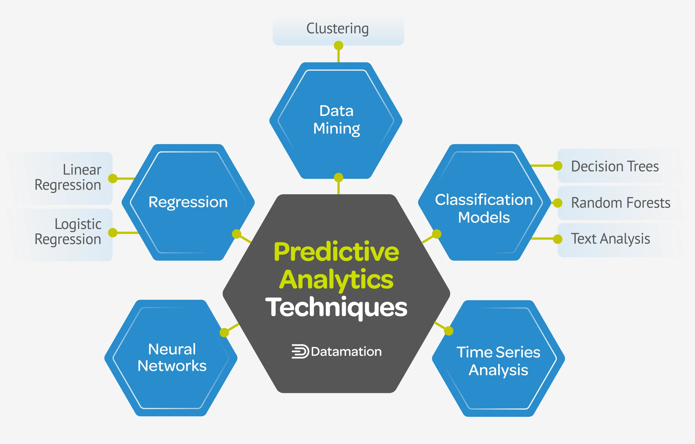
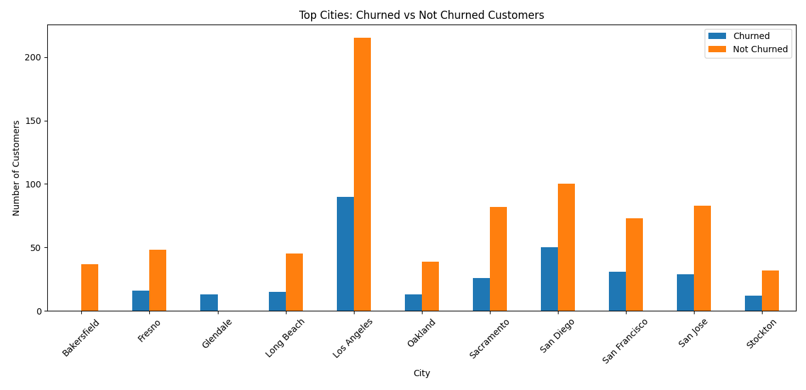
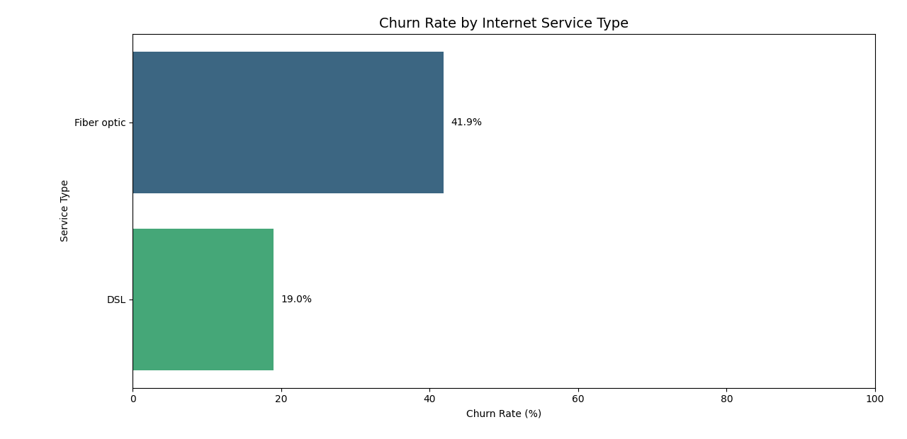
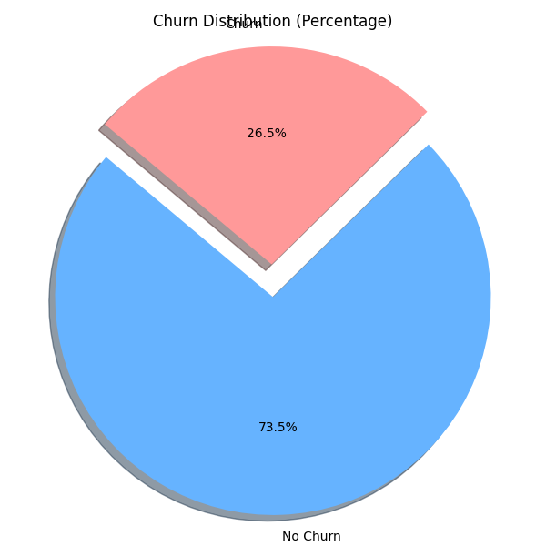
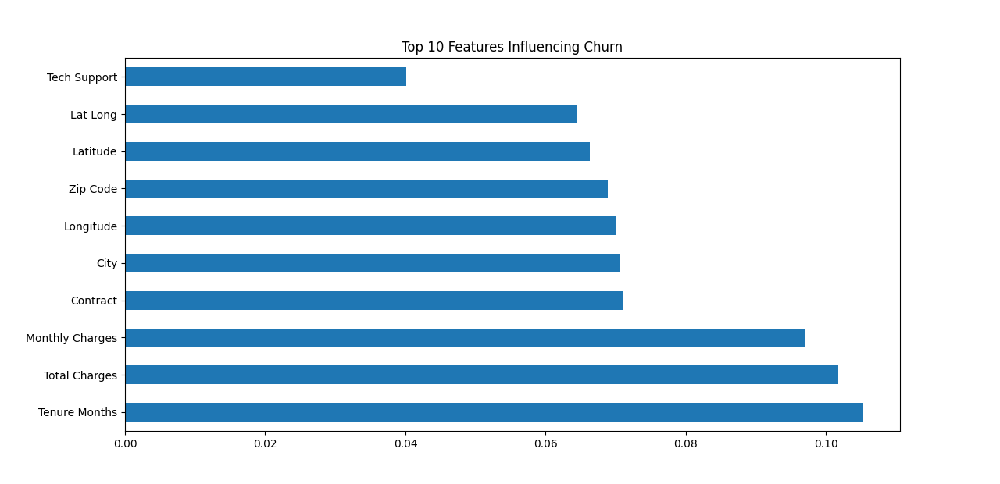

# Churn_Analysis
Consumers Churn Data Analysis with Random Forest Predictive Classification Model

<h1>Numbers of Churn Per US Cities</h1>

| City           | Churn Count |
|----------------|-------------|
| Los Angeles    | 90          |
| San Diego      | 50          |
| San Francisco  | 31          |
| San Jose       | 29          |
| Sacramento     | 26          |
| Fresno         | 16          |
| Long Beach     | 15          |
| Glendale       | 13          |
| Oakland        | 13          |
| Stockton       | 12          |

<h2>Conclusion</h2>
<pr>This Analysis Concluded with the result that this data set contains more Non Churn Users than Churn Users. Churning of Users are influnceed by various features Top 10 are as shown in the images below. </pr>

<h2>Machine Learning Prediction Model Results</h2>
<pr> Random Forest Classification Model with 80% Accuracy also Suggest There is less Non Churn Consumers in this Dataset. </pr>

<h2>Classification Report</h2>

<table border="1" cellpadding="5" cellspacing="0">
  <thead>
    <tr>
      <th>Class</th>
      <th>Precision</th>
      <th>Recall</th>
      <th>F1-Score</th>
      <th>Support</th>
    </tr>
  </thead>
  <tbody>
    <tr>
      <td><strong>0</strong></td>
      <td>0.83</td>
      <td>0.91</td>
      <td>0.87</td>
      <td>1009</td>
    </tr>
    <tr>
      <td><strong>1</strong></td>
      <td>0.70</td>
      <td>0.52</td>
      <td>0.60</td>
      <td>400</td>
    </tr>
    <tr>
      <td colspan="3"></td>
      <td><strong>Accuracy</strong></td>
      <td>0.80</td>
    </tr>
    <tr>
      <td><strong>Macro Avg</strong></td>
      <td>0.76</td>
      <td>0.72</td>
      <td>0.73</td>
      <td>1409</td>
    </tr>
    <tr>
      <td><strong>Weighted Avg</strong></td>
      <td>0.79</td>
      <td>0.80</td>
      <td>0.79</td>
      <td>1409</td>
    </tr>
  </tbody>
</table>

<pr> In above report of prediction model '0' denotes Non churn and '1' denotes Churn Consumers of the services. </pr>
      

